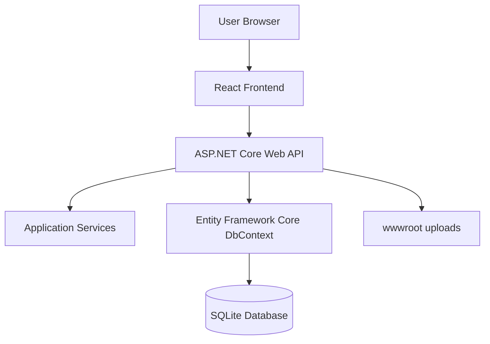
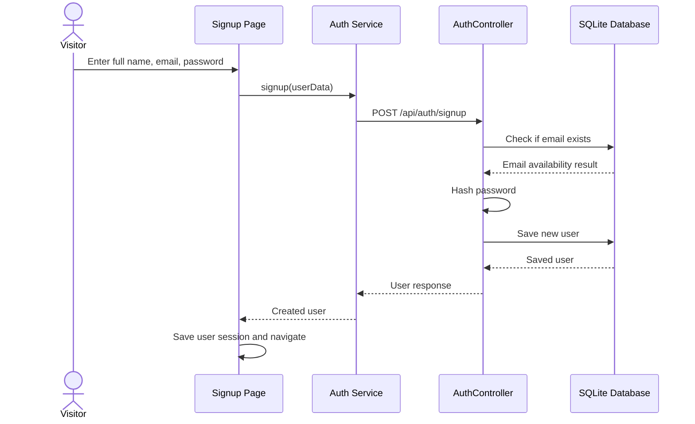
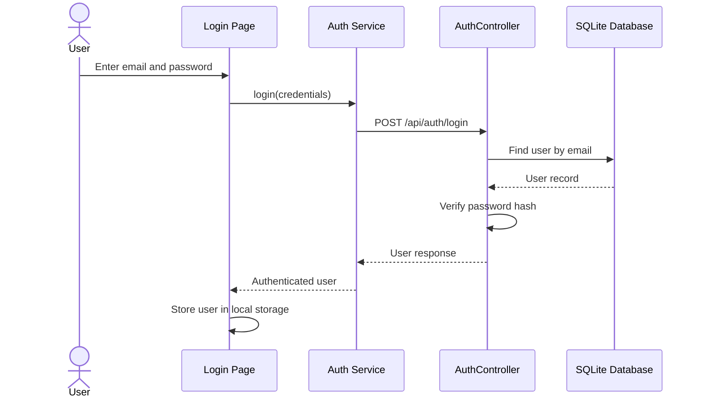
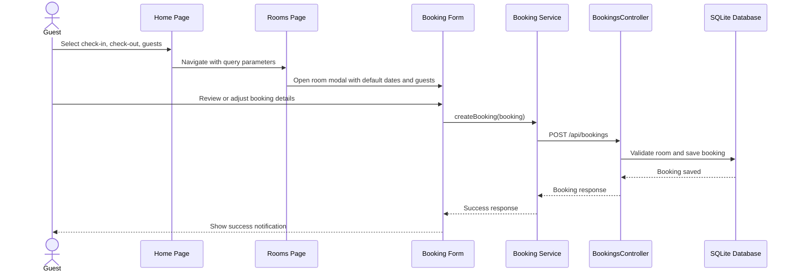
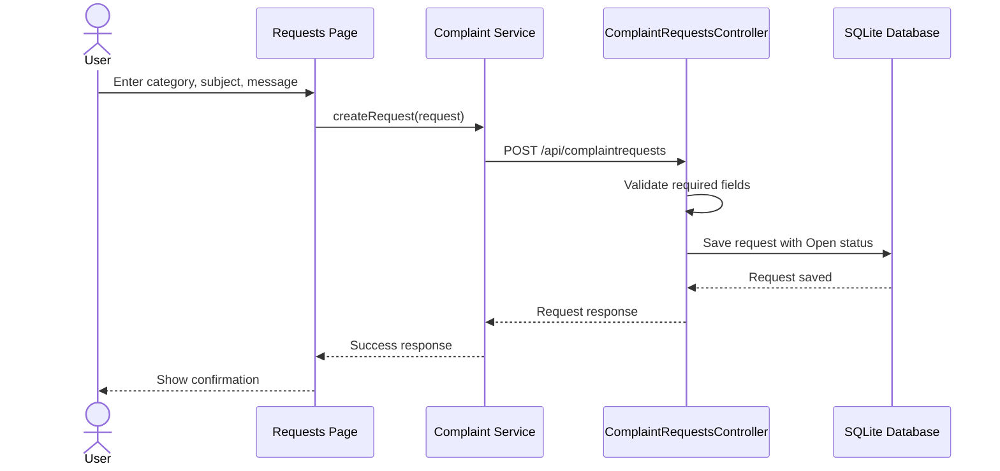
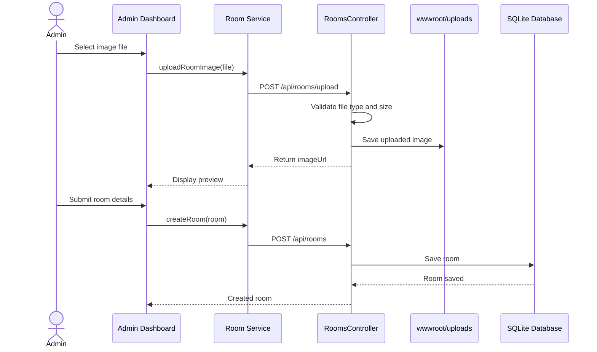
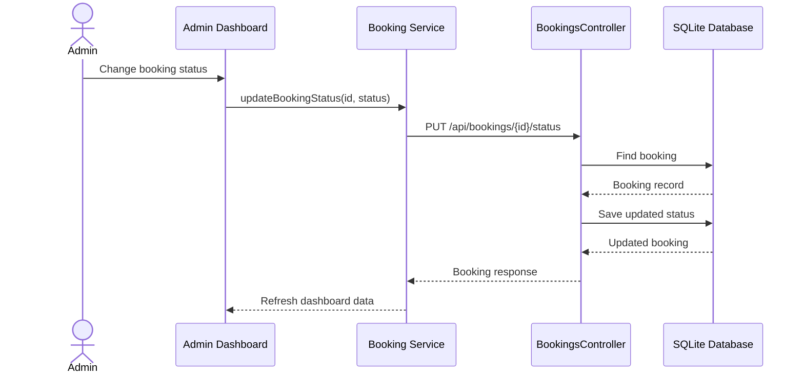
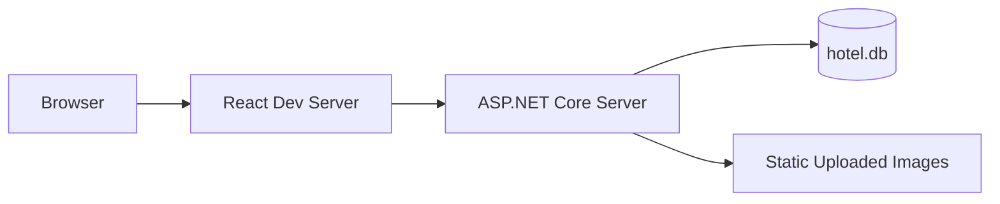

# High-Level Design Document

## Project Title

LuxeStay Istanbul Hotel Reservation System

## System Overview

The system is a full-stack web application with a React frontend, ASP.NET Core Web API backend, Entity Framework Core data access layer, and SQLite database.

The frontend provides the user interface for browsing rooms, booking rooms, submitting requests, and administering hotel data. The backend exposes REST API endpoints for users, authentication, rooms, bookings, and complaint requests. The database stores rooms, users, bookings, and requests.

## High-Level Architecture

## Main Frontend Modules

| Module | Responsibility |
| --- | --- |
| Home | Displays hero section, date and guest search, and featured rooms. |
| Rooms | Displays all rooms with search, sorting, and booking actions. |
| RoomDetails | Displays selected room details, gallery, amenities, and booking panel. |
| BookingForm | Handles booking form validation and submission. |
| MyReservations | Displays guest reservations and cancellation action. |
| Requests | Handles complaint and request submission. |
| AdminDashboard | Allows admin to manage rooms, bookings, users, and requests. |
| Navbar | Provides navigation, responsive mobile drawer, and theme toggle. |
| Footer | Displays hotel contact details and useful links. |

## Main Backend Modules

| Module | Responsibility |
| --- | --- |
| AuthController | Handles signup and login. |
| RoomsController | Handles room listing, creation, update, deletion, and image upload. |
| BookingsController | Handles booking creation, listing, user reservations, status update, and cancellation. |
| ComplaintRequestsController | Handles complaint or request creation, listing, and status update. |
| UsersController | Provides user list data for admin dashboard. |
| ApplicationDbContext | Defines database tables and relationships. |
| PasswordHasher | Hashes and verifies user passwords. |

## Sequence Diagram: User Signup

## Sequence Diagram: User Login

## Sequence Diagram: Browse Rooms and Book Room

## Sequence Diagram: Submit Complaint or Request

## Sequence Diagram: Admin Adds Room With Image Upload

## Sequence Diagram: Admin Updates Booking Status

## Deployment View

