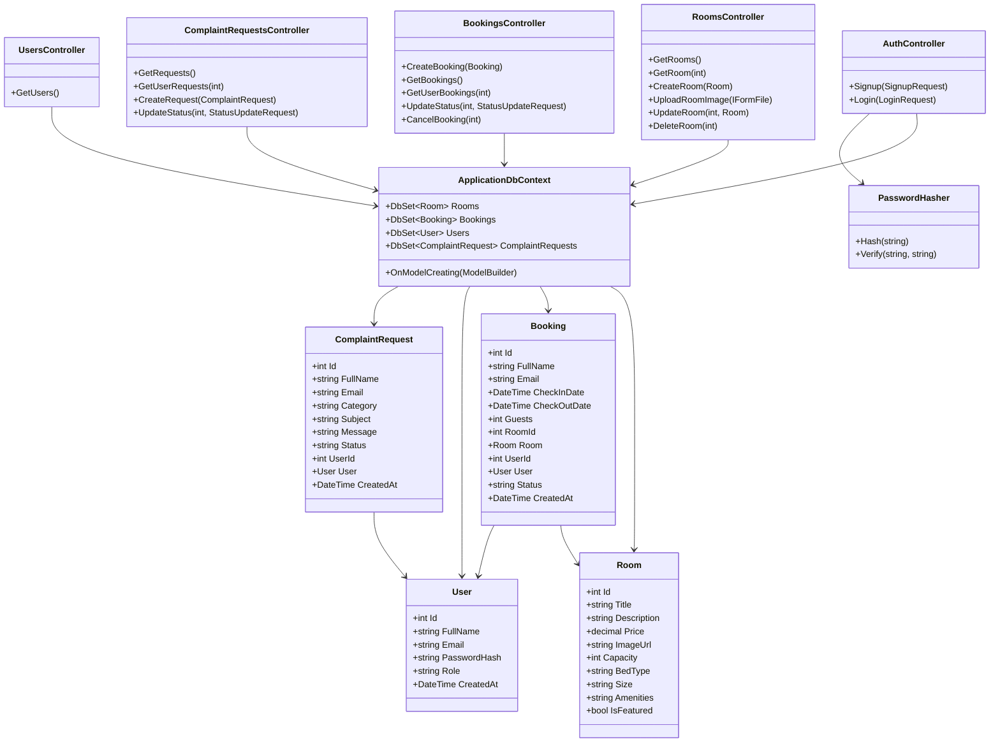
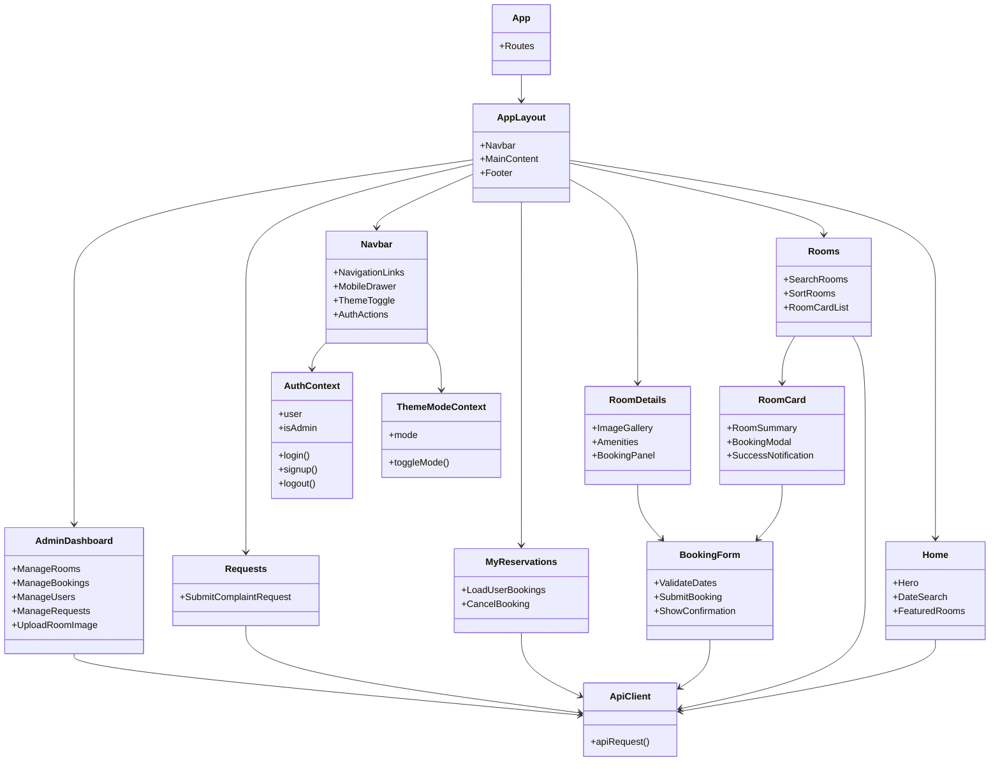
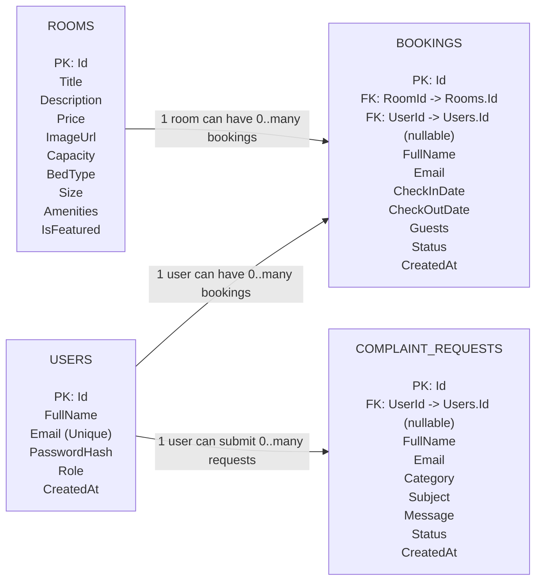

# Low-Level Design Document

## Project Title

LuxeStay Istanbul Hotel Reservation System

## Purpose

This document describes the low-level structure of the application, including the main classes, frontend modules, backend API controllers, and database entities.

## Backend Class Diagram

## Frontend Module Diagram

## Entity Relationship Diagram

## Entity Relationship Summary

| Relationship | Cardinality | Foreign Key | Meaning |
| --- | --- | --- | --- |
| Users to Bookings | One-to-many | `Bookings.UserId` | A registered guest can create many bookings. A booking can also keep guest name and email even if the user is removed. |
| Rooms to Bookings | One-to-many | `Bookings.RoomId` | A room can appear in many bookings over time. Each booking belongs to one room. |
| Users to ComplaintRequests | One-to-many | `ComplaintRequests.UserId` | A registered guest can submit many complaints or requests. Visitor requests can be stored without a user id. |

## Database Table Details

### Users

| Field | Type | Description |
| --- | --- | --- |
| Id | int | Primary key. |
| FullName | string | User full name. |
| Email | string | Unique user email address. |
| PasswordHash | string | Hashed password. |
| Role | string | User role such as `Guest` or `Admin`. |
| CreatedAt | DateTime | Date and time user account was created. |

### Rooms

| Field | Type | Description |
| --- | --- | --- |
| Id | int | Primary key. |
| Title | string | Room name. |
| Description | string | Room description. |
| Price | decimal | Price per night. |
| ImageUrl | string | Image path or uploaded image URL. |
| Capacity | int | Maximum guest capacity. |
| BedType | string | Bed type information. |
| Size | string | Room size. |
| Amenities | string | Comma-separated amenity list. |
| IsFeatured | bool | Whether the room appears in featured stays. |

### Bookings

| Field | Type | Description |
| --- | --- | --- |
| Id | int | Primary key. |
| FullName | string | Name of booking guest. |
| Email | string | Email of booking guest. |
| CheckInDate | DateTime | Booking check-in date. |
| CheckOutDate | DateTime | Booking check-out date. |
| Guests | int | Number of guests. |
| RoomId | int | Foreign key to Rooms. |
| UserId | int | Optional foreign key to Users. |
| Status | string | Booking status such as `Pending`, `Confirmed`, or `Cancelled`. |
| CreatedAt | DateTime | Date and time booking was created. |

### ComplaintRequests

| Field | Type | Description |
| --- | --- | --- |
| Id | int | Primary key. |
| FullName | string | Sender name. |
| Email | string | Sender email. |
| Category | string | Request category. |
| Subject | string | Request subject. |
| Message | string | Request message. |
| Status | string | Request status such as `Open` or `Resolved`. |
| UserId | int | Optional foreign key to Users. |
| CreatedAt | DateTime | Date and time request was created. |

## API Endpoint Summary

| Endpoint | Method | Purpose |
| --- | --- | --- |
| `/api/auth/signup` | POST | Register a new guest account. |
| `/api/auth/login` | POST | Authenticate a user. |
| `/api/rooms` | GET | Get all rooms. |
| `/api/rooms/{id}` | GET | Get one room by id. |
| `/api/rooms` | POST | Create a room. |
| `/api/rooms/upload` | POST | Upload a room image. |
| `/api/rooms/{id}` | PUT | Update a room. |
| `/api/rooms/{id}` | DELETE | Delete a room without bookings. |
| `/api/bookings` | POST | Create a booking. |
| `/api/bookings` | GET | Get all bookings. |
| `/api/bookings/user/{userId}` | GET | Get bookings for one user. |
| `/api/bookings/{id}/status` | PUT | Update booking status. |
| `/api/bookings/{id}` | DELETE | Cancel a booking. |
| `/api/complaintrequests` | GET | Get all complaints and requests. |
| `/api/complaintrequests/user/{userId}` | GET | Get requests for one user. |
| `/api/complaintrequests` | POST | Create a complaint or request. |
| `/api/complaintrequests/{id}/status` | PUT | Update complaint or request status. |
| `/api/users` | GET | Get all users for admin dashboard. |
