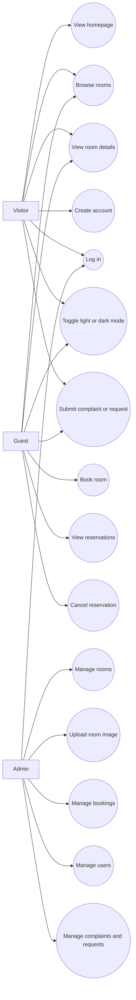

# Requirement Analysis Document

## Project Title

LuxeStay Istanbul Hotel Reservation System

## Project Description

LuxeStay Istanbul is a full-stack hotel reservation system that allows guests to browse rooms, create an account, book rooms, view reservations, and submit complaints or service requests. The system also provides an admin dashboard for managing rooms, bookings, users, and guest requests.

The application is built as an academic project using React, Material UI, ASP.NET Core Web API, Entity Framework Core, and SQLite.

## Project Objectives

- Provide a responsive hotel website for desktop, tablet, and mobile users.
- Allow visitors to browse available rooms and room details.
- Allow guests to create accounts, log in, and manage their reservations.
- Allow guests to submit complaints or requests to the hotel.
- Allow administrators to manage rooms, bookings, users, and submitted requests.
- Support light mode and dark mode for better accessibility and user preference.
- Store hotel data in a SQLite database.

## System Actors

| Actor | Description |
| --- | --- |
| Visitor | A user who can browse rooms, view hotel information, create an account, and submit a request. |
| Guest | A logged-in user who can book rooms, view reservations, cancel reservations, and submit requests. |
| Admin | A hotel staff user who can manage rooms, bookings, users, and complaints or requests. |
| System | The application backend and database that process and store data. |

## Functional Requirements

### Visitor Requirements

- The visitor can view the homepage.
- The visitor can view featured rooms.
- The visitor can browse all rooms.
- The visitor can search and sort rooms.
- The visitor can view room details and images.
- The visitor can create an account.
- The visitor can log in.
- The visitor can submit a complaint or request.
- The visitor can toggle between light mode and dark mode.

### Guest Requirements

- The guest can book a room.
- The guest can select check-in date, check-out date, and guest count.
- The guest can carry homepage date and guest selections into the room booking form.
- The guest can receive a booking success notification.
- The guest can view their reservations.
- The guest can cancel a reservation.
- The guest can submit complaints or requests with contact details.
- The guest can log out.

### Admin Requirements

- The admin can log in with an admin account.
- The admin can view all bookings.
- The admin can update booking status.
- The admin can view all users.
- The admin can view all complaints and requests.
- The admin can update complaint or request status.
- The admin can create rooms.
- The admin can edit room details.
- The admin can delete rooms that do not have bookings.
- The admin can upload room images.
- The admin can mark rooms as featured.

## Non-Functional Requirements

- The user interface must be responsive on mobile, tablet, and desktop screens.
- The system must provide clear feedback after important actions such as booking and request submission.
- The system must validate required form fields.
- The system must prevent invalid booking date ranges.
- The system must use simple and understandable navigation.
- The system must support persistent login sessions using local storage.
- The system must store data in SQLite through Entity Framework Core.
- Uploaded room images must be image files and must be limited to allowed file types and size.

## System Constraints

- Authentication is intentionally simple for academic demonstration.
- The system is not designed as a production hotel booking platform.
- Payment processing is outside the scope of this project.
- Real-time room availability checking is outside the current scope.

## Assumptions

- An admin account is seeded or available for demonstration.
- Room records exist in the database for browsing and booking.
- A guest must be logged in before a booking can be saved.
- A cancelled booking remains in the system with status `Cancelled`.

## Use Case Diagram

## Use Case Summary

| Use Case | Main Actor | Description |
| --- | --- | --- |
| Create Account | Visitor | Visitor submits full name, email, and password to register as a guest. |
| Log In | Visitor, Guest, Admin | User enters email and password to access member or admin features. |
| Browse Rooms | Visitor, Guest | User views rooms with images, descriptions, prices, amenities, and sorting options. |
| Book Room | Guest | Guest selects room, dates, guest count, and submits a reservation request. |
| View Reservations | Guest | Guest views their saved reservations and status. |
| Cancel Reservation | Guest | Guest changes reservation status to cancelled. |
| Submit Request | Visitor, Guest | User submits a complaint, question, or service request. |
| Manage Rooms | Admin | Admin creates, edits, deletes, uploads room image, and marks featured rooms. |
| Manage Bookings | Admin | Admin views bookings and updates booking status. |
| Manage Requests | Admin | Admin views requests and updates request status. |
| Manage Users | Admin | Admin views registered system users. |
